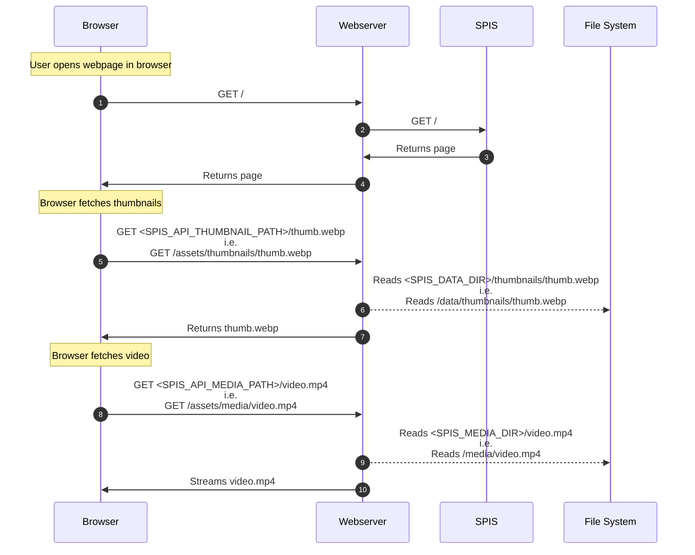

<h1>SPIS</h1>

[](https://github.com/gbbirkisson/spis/releases)
[](https://github.com/gbbirkisson/spis/commits/main)
[](https://github.com/gbbirkisson/spis/actions/workflows/ci.yml)
[](https://codecov.io/github/gbbirkisson/spis)
[](https://github.com/gbbirkisson/spis/blob/main/LICENSE)

This project is called "Simple Private Image Server" or `SPIS` for short. It's purpose is to be a lightweight and fast server to display media hosted on a private server. This project came about when I was searching for a solution like this and found nothing. Everything seemed way too feature heavy and slow, requiring you to setup databases and other unnecessary components.

The goals for this project are:
* Simple to setup 🏝️
* Flexible to operate ➰
* Lightweight, multi-threaded and fast 🚀
* Minimalistic GUI 🤩
* Easy to use on mobile 📱

Some features worth mentioning:
* Endless scrolling 📜
* Mark favorites ❤️
* Filter by year, month, favorites 🎚️
* Instantly load new files 📨
* Is a progressive web app 📲

I personally use this project to host around `40.000` images on a [Raspberry Pi CM4](https://www.raspberrypi.com/products/compute-module-4/) 🤯

If this project is just what you needed and/or has been helpful to you, please consider buying me a coffee ☕

[](https://www.buymeacoffee.com/gbbirkisson)

<h2>Table of contents</h2>

<!-- vim-markdown-toc GFM -->

* [Screenshots](#screenshots)
* [Setup](#setup)
    * [Configuration](#configuration)
    * [Docker](#docker)
    * [Binary](#binary)
        * [Why do we need a webserver](#why-do-we-need-a-webserver)
        * [Diagram](#diagram)
        * [So how do I set this up?](#so-how-do-i-set-this-up)
        * [Debian + Systemd + Nginx](#debian--systemd--nginx)
* [Progressive Web App](#progressive-web-app)
* [Release notes](#release-notes)
* [Development](#development)
    * [Setup dependencies](#setup-dependencies)
    * [Install pre-commit hooks](#install-pre-commit-hooks)
    * [Get some test media](#get-some-test-media)
    * [Running](#running)

<!-- vim-markdown-toc -->

## Screenshots

This is how the GUI looks on mobile!

<p float="left">


</p>

## Setup

### Configuration

Everything is configured via environmental variables:

Variable Name | Required | Default | Description
--- | --- | --- | ---
`SPIS_MEDIA_DIR` | `Yes` | | What directory `SPIS` will look for media
`SPIS_DATA_DIR` | `Yes` | | What directory `SPIS` will store its data (database and thumbnails)
`SPIS_PROCESSING_SCHEDULE` | `No` | `0 0 2 * * *` | When should `SPIS` scan for new media (default is every night at 2)
`SPIS_PROCESSING_RUN_ON_START` | `No` | `false` | Should `SPIS` scan for media on startup
`SPIS_API_MEDIA_PATH` | `No` | `/assets/media` | On what path will the webserver (`nginx`) serve media files __*__
`SPIS_API_THUMBNAIL_PATH` | `No` | `/assets/thumbnails` | On what path will the webserver (`nginx`) serve thumbnails __*__
`SPIS_SERVER_SOCKET` | `No` | `/var/run/spis.sock` | Path of the socket `SPIS` will listen to __**__
`SPIS_SERVER_ADDRESS` | `No` | | Address `SPIS` will listen to rather than socket, i.e. `0.0.0.0:8000` __**__
`SPIS_FEATURE_FAVORITE` | `No` | `true` | Enable favorite feature
`SPIS_FEATURE_ARCHIVE` | `No` | `true` | Enable archive feature
`RUST_LOG` | `No` | | Loglevels of the application, i.e. `error,spis=info`

__*__ These are the paths that the webserver (`nginx`) serves media and thumbnails on. For a details on how this works, look at the [diagram](#diagram).

__**__ You cannot make `SPIS` listen to both a socket and an address. So by setting `SPIS_SERVER_ADDRESS` you will disable `SPIS_SERVER_SOCKET`.

### Docker

Easiest way to run `SPIS` is with the docker image:

```console
$ docker run -it \
    -p 8080:8080 \
    -v /path/to/your/media:/var/lib/spis/media \
    -v /path/to/save/data:/var/lib/spis/data \
    ghcr.io/gbbirkisson/spis
```

or using `docker compose`:

```yaml
services:
  spis:
    image: ghcr.io/gbbirkisson/spis
    ports:
      - "8080:8080"
    volumes:
      # This assumes you want to keep the SPIS data in a
      # docker volume and not in some directory
      - data:/var/lib/spis/data
      - ./path/to/your/media:/var/lib/spis/media
volumes:
  data:
```

> [!TIP]
> Try running the [docker compose](./examples/docker/docker-compose.yml) example by running...
> ```console
> $ cd examples/docker
> $ docker compose up
> ```
> ... and open up http://localhost:8080 in your browser.

### Binary

If you want to run the binary, you will need to understand that `SPIS` needs a webserver to serve media.

#### Why do we need a webserver

Because, serving images and videos is complicated! It involves caching, compressing, streaming and a host of other problems that `SPIS` does not need to know about. Some people that are way smarter than me have found a solution for all these problems. So instead of implementing a bad solution in `SPIS`, we stand on the shoulders of others and use a tried and tested webserver to handle this complexity for us.

#### Diagram

So how do these things tie together. Well here is a simplified diagram of what happens when you open up `SPIS` in the browser.

> [!NOTE]
> Never during the interaction does `SPIS` read images of the file system and serve them.



#### So how do I set this up?

Well these are the steps:

1. [Download a binary](https://github.com/gbbirkisson/spis/releases) for your architecture and put in your path
2. Install a webserver
3. For video support make sure `ffmpeg` and `ffprobe` are in your path.
4. Configure `SPIS` and run....we will get back to this
5. Configure webserver and run....we will get back to this

Now, steps `4-5` are super unhelpful (a bit like instructions on how to draw an owl). This is because `SPIS` is flexible, and does not care how you do this. You can use any combination of webserver + supervisor to get this up and running. So covering every single way to set this up is not feasible.

So I'm just going to describe how to do this with `systemd` and `nginx` on a `debian` system.

#### Debian + Systemd + Nginx

1. [Download a binary](https://github.com/gbbirkisson/spis/releases) for your architecture and save it as `/usr/local/bin/spis`. Make sure it is executable (`chmod +x /usr/local/bin/spis`)
2. Install `nginx`: `sudo apt install nginx`
3. Add video support: `apt install ffmpeg`
4. Configure `SPIS` and run:
    1. Create these folders and make sure user `www-data` owns them:
        * `/storage/spis/data`
        * `/storage/spis/media`
    2. Create the file `/etc/systemd/system/spis.service`
    3. Set the contents of the file to be the same as the [spis.service](./examples/systemd/spis.service) example.
    4. Enable and start `SPIS`: `systemctl enable --now spis`
5. Configure `nginx` and run:
    1. Create the file `/etc/nginx/sites-available/default`
    2. Set the contents of the file to be the same as the [nginx.conf](./examples/systemd/nginx.conf) example.
    3. Enable and start `nginx`: `systemctl enable --now nginx`

Now `SPIS` will process and serve any image/video that you place in `/storage/spis/media`. Just make sure the files are owned by the `www-data` user.

Open up `SPIS` on http://yourserver:8080

## Progressive Web App

You can add `SPIS` as a `PWA` to your desktop or mobile. Open up the `SPIS` home page in a browser on the device, open the top-right menu, and select `Add to Home screen`, `Install` or something to that extent.

## Release notes

This project uses [release-please](https://github.com/googleapis/release-please) and because of how it is set up, there are separate release notes for each component of `SPIS`. Therefore the easiest way to read all the release notes in one place is to look at the relevant [PR for each release](https://github.com/gbbirkisson/spis/pulls?q=is%3Apr+label%3Arelease+is%3Aclosed). I know its a bit tedious to find the right PR, sorry about that.

## Development

I use [mise](https://github.com/jdx/mise) to manage local building and testing. I also use
[direnv](https://direnv.net/) to setup the development environment.

### Setup dependencies

```console
$ mise run setup
```

### Install pre-commit hooks

```console
$ pre-commit install --hook-type commit-msg
```

### Get some test media

I leave it up do you to put some images/videos in the `./data/media` folder.

### Running

Run stack with:

```console
$ mise run dev
```

And then open http://localhost:8080 in your browser
