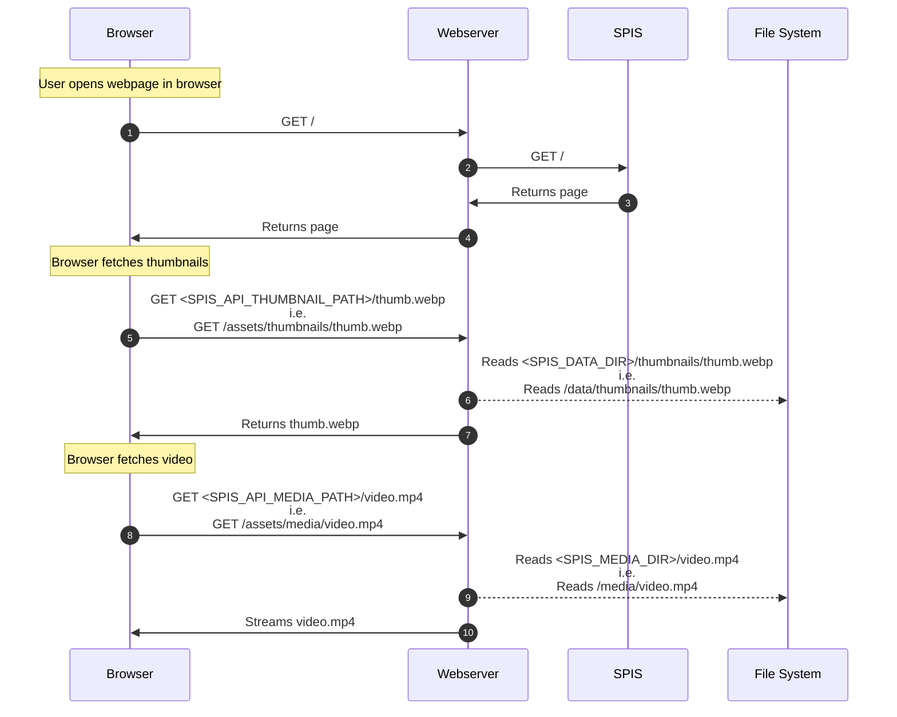

<h1>SPIS</h1>

[](https://github.com/gbbirkisson/spis/releases)
[](https://github.com/gbbirkisson/spis/commits/main)
[](https://github.com/gbbirkisson/spis/actions/workflows/ci.yml)
[](https://codecov.io/github/gbbirkisson/spis)
[](https://github.com/gbbirkisson/spis/blob/main/LICENSE)

This project is called "Simple Private Image Server" or `SPIS` for short. It's purpose is to be
a lightweight and fast server to display media hosted on a private server. This project came
about when I was searching for a solution like this and found nothing. Everything seemed way too
feature heavy and slow, requiring you to setup databases and other unnecessary components.

The goals for this project are:
* Simple to setup 🏝️
* Flexible to operate ➰
* Lightweight, multi-threaded and fast 🚀
* Minimalistic GUI 🤩
* Easy to use on mobile 📱

Some features worth mentioning:
* Endless scrolling 📜
* Mark favorites ❤️
* Filter by year, month, favorites 🎚️
* Instantly load new files 📨
* Is a progressive web app 📲

I personally use this project to host around `40.000` images on a [Raspberry Pi CM4](https://www.raspberrypi.com/products/compute-module-4/) 🤯

If this project is just what you needed and/or has been helpful to you, please consider buying
me a coffee ☕

[](https://www.buymeacoffee.com/gbbirkisson)

<h2>Table of contents</h2>

<!-- vim-markdown-toc GFM -->

* [Demo](#demo)
* [Configuration](#configuration)
* [Running](#running)
    * [Docker](#docker)
    * [Binary](#binary)
        * [Why do we need a webserver](#why-do-we-need-a-webserver)
        * [Diagram](#diagram)
        * [So how do I set this up?](#so-how-do-i-set-this-up)
        * [Debian + Systemd + Nginx](#debian--systemd--nginx)
* [Configuration templating](#configuration-templating)
* [Progressive Web App](#progressive-web-app)
* [Changelog](#changelog)
* [Development](#development)
    * [Setup toolchain](#setup-toolchain)
    * [Install pre-commit hooks](#install-pre-commit-hooks)
    * [Get some test media](#get-some-test-media)
    * [Running](#running-1)

<!-- vim-markdown-toc -->

## Demo

Go to [spis.fly.dev](https://spis.fly.dev) to see a live demo! Also try opening the demo on your
mobile.

## Configuration

Configuration is done either by passing in the appropriate flags or setting environmental
variables. You can always run `spis help` to see how to configure the server:

```console
$ spis help
Simple private image server

Usage: spis [OPTIONS] [COMMAND]

Commands:
  run       Runs the server [default]
  process   Test process media files
  template  Render configuration templates
  help      Print this message or the help of the given subcommand(s)

Options:
      --media-dir <MEDIA_DIR>
          Path to search for media files [env: SPIS_MEDIA_DIR=] [default: ]
      --data-dir <DATA_DIR>
          Path to store data [env: SPIS_DATA_DIR=] [default: ]
      --processing-schedule <PROCESSING_SCHEDULE>
          Schedule to run processing on [env: SPIS_PROCESSING_SCHEDULE=] [default: "0 0 2 * * *"]
      --processing-run-on-start
          Run processing on start [env: SPIS_PROCESSING_RUN_ON_START=]
      --api-media-path <API_MEDIA_PATH>
          Path webserver will serve media on [env: SPIS_API_MEDIA_PATH=] [default: /assets/media]
      --api-thumbnail-path <API_THUMBNAIL_PATH>
          Path webserver will serve thumbnails on [env: SPIS_API_THUMBNAIL_PATH=] [default: /assets/thumbnails]
      --server-address <SERVER_ADDRESS>
          Listen to address [env: SPIS_SERVER_ADDRESS=]
      --server-socket <SERVER_SOCKET>
          Listen to UNIX socket [env: SPIS_SERVER_SOCKET=]
      --feature-favorite
          Disable feature favorite [env: SPIS_FEATURE_FAVORITE=]
      --feature-archive
          Disable feature archive [env: SPIS_FEATURE_ARCHIVE=]
      --feature-follow-symlinks
          Disable feature follow symlinks [env: SPIS_FEATURE_FOLLOW_SYMLINKS=]
      --feature-allow-no-exif
          Disable feature no exif [env: SPIS_FEATURE_NO_EXIF=]
  -h, --help
          Print help
  -V, --version
          Print version
```

> [!NOTE]
> Either `SERVER_ADDRESS` or `SERVER_SOCKET` need to be set, but not both!

> [!TIP]
> Both `SPIS_API_MEDIA_PATH` and `SPIS_API_THUMBNAIL_PATH` refer to how the webserver (`nginx`)
> is configured to serve media. For a details on how this works, look at the
> [diagram](#diagram).

## Running

### Docker

Easiest way to run `spis` is with the docker image:

```console
$ docker run -it \
    -p 8080:8080 \
    -v /path/to/your/media:/var/lib/spis/media \
    -v /path/to/save/data:/var/lib/spis/data \
    ghcr.io/gbbirkisson/spis
```

or using `docker compose`. Try the [docker compose](./examples/docker/docker-compose.yml) example by running...
> ```console
> $ cd examples/docker
> $ docker compose up
> ```
> ... and open up http://localhost:8080 in your browser.

### Binary

If you want to run the binary, you will need to understand that `spis` needs a webserver to serve media.

#### Why do we need a webserver

Because, serving images and videos is complicated! It involves caching, compressing, streaming and a host of other problems that `spis` does not need to know about. Some people that are way smarter than me have found a solution for all these problems. So instead of implementing a bad solution in `spis`, we stand on the shoulders of others and use a tried and tested webserver to handle this complexity for us.

#### Diagram

So how do these things tie together. Well here is a simplified diagram of what happens when you open up `spis` in the browser.

> [!NOTE]
> Never during the interaction does `spis` read images of the file system and serve them.



#### So how do I set this up?

Well these are the steps:

1. [Download a binary](https://github.com/gbbirkisson/spis/releases) for your architecture and put in your path
2. Install a webserver
3. For video support make sure `ffmpeg` and `ffprobe` are in your path.
4. Configure `spis` and run....we will get back to this
5. Configure webserver and run....we will get back to this

Now, steps `4-5` are super unhelpful (a bit like instructions on how to draw an owl). This is because `spis` is flexible, and does not care how you do this. You can use any combination of webserver + supervisor to get this up and running. So covering every single way to set this up is not feasible.

So I'm just going to describe how to do this with `systemd` and `nginx` on a `debian` system.

#### Debian + Systemd + Nginx

> [!NOTE]
> We are using [configuration templating](#configuration-templating) in this example!
```console
# 1.1 Download spis
$ sudo curl -L -o /usr/local/bin/spis https://github.com/gbbirkisson/spis/releases/download/latest/spis-x86_64-unknown-linux-gnu

# 1.2 Make executable
$ sudo chmod +x /usr/local/bin/spis

# 2. Install nginx
$ sudo apt install nginx

# 3. Add video support
$ sudo apt install ffmpeg

# 4.1 Set SPIS dirs
$ export SPIS_MEDIA_DIR=/storage/spis/media
$ export SPIS_DATA_DIR=/storage/spis/data

# 4.2 Create spis dirs
$ mkdir -p ${SPIS_MEDIA_DIR} ${SPIS_DATA_DIR}

# 4.3 Make sure user `www-data` owns dirs
$ chown www-data:www-data ${SPIS_MEDIA_DIR} ${SPIS_DATA_DIR}

# 4.4 Configure systemd to run spis
$ sudo spis --server-socket ${SPIS_DATA_DIR}/spis.sock \
    template systemd --bin $(which spis) --user www-data > /etc/systemd/system/spis.service

# 4.5 Enable and start spis service
$ systemctl enable --now spis

# 5.1 Configure nginx
$ spis
    --server-socket /storage/spis/data/spis.sock \
    template nginx --port 8080 > /etc/nginx/sites-available/default

# 4.5 Enable and start nginx service
$ systemctl enable --now nginx
```

Now `spis` will process and serve any image/video that you place in `/storage/spis/media`. Just make sure the files are owned by the `www-data` user.

Open up `spis` on http://yourserver:8080

## Configuration templating

You can use `spis` to render configuration for various components. In fact, the
[examples](./examples) in this repository are all created this way.
```console
$ spis template --help
Render configuration templates

Usage: spis template <COMMAND>

Commands:
  nginx           Template nginx configuration
  systemd         Template systemd configuration
  docker-compose  Template docker compose configuration
  help            Print this message or the help of the given subcommand(s)

Options:
  -h, --help  Print help
```

## Progressive Web App

You can add `spis` as a `PWA` to your desktop or mobile. Open up the `spis` home page in a browser on the device, open the top-right menu, and select `Add to Home screen`, `Install` or something to that extent.

## Changelog

You can take a look at the [CHANGELOG](/CHANGELOG.md) for version information and release notes.

## Development

I use [direnv](https://direnv.net/) to setup the development environment and `make` to run
everything.

### Setup toolchain

```console
# Setup rust toolchain
$ make toolchain

# You need nginx installed on your system
$ sudo apt install nginx
```

### Install pre-commit hooks

```console
$ pre-commit install --hook-type commit-msg
```

### Get some test media

I leave it up do you to put some images/videos in the `./data/media` folder.

### Running

Run stack with:

```console
$ make dev
```

And then open http://localhost:8080 in your browser
