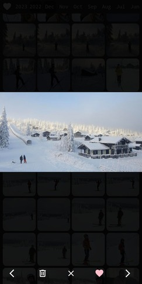

❤️

<h1>SPIS</h1>

[](https://github.com/gbbirkisson/spis/releases)
[](https://github.com/gbbirkisson/spis/commits/main)
[](https://github.com/gbbirkisson/spis/actions/workflows/ci.yml)
[](https://codecov.io/github/gbbirkisson/spis)
[](https://github.com/gbbirkisson/spis/blob/main/LICENSE)

This project is called "Simple Private Image Server" or `SPIS` for short. It's purpose is to be a lightweight and fast server to display media hosted on a private server. This project came about when I was searching for a solution like this and found nothing. Everything seemed way to feature heavy and slow, requiring you to setup databases and other unnecessary components.

The goals for this project are:
* Simple to setup 🏝️
* Lightweight, multi-threaded and fast 🚀
* Minimalistic GUI 🤩
* Easy to use on mobile 📱

Some features worth mentioning:
* Endless scrolling 📜
* Mark favorites 💜
* Filtering by year, month, favorites 🎚️
* Is a progressive web app 📱

<h2>Table of contents</h2>

- [Screenshots](#screenshots)
- [Setup](#setup)
  - [Configuration](#configuration)
  - [Docker](#docker)
  - [Binary](#binary)
- [Progressive Web App](#progressive-web-app)
- [Development](#development)
  - [Setup dependencies](#setup-dependencies)
  - [Get some test media](#get-some-test-media)
  - [Running](#running)

## Screenshots

This is how the GUI looks!




## Setup

### Configuration

Everything is configured via environmental variables:

Variable Name | Required | Default | Description
--- | --- | --- | ---
`SPIS_MEDIA_DIR` | `Yes` | | Where should the server look for media
`SPIS_DATA_DIR` | `Yes` | | Where should the server store its data
`SPIS_PROCESSING_SCHEDULE` | `No` | `0 0 2 * * *` | When should the server look for media (default is every night at 2)
`SPIS_PROCESSING_RUN_ON_START` | `No` | `false` | Should the server look for media on start
`SPIS_API_MEDIA_PATH` | `No` | `/assets/media` | Where will the media be served by webserver
`SPIS_API_THUMBNAIL_PATH` | `No` | `/assets/thumbnails` | Where will the thumbnails be served by webserver
`SPIS_SERVER_SOCKET` | `No` | `/var/run/spis.sock` | Path of the socket the server will listen to
`SPIS_SERVER_ADDRESS` | `No` | | Address to listen to rather than socket, i.e. `0.0.0.0:8000` 
`RUST_LOG` | `No` | | Loglevels of the application, i.e. `error,spis_server=info`

### Docker

Easiest way to run `SPIS` is with the docker image:

```console
$ docker run -it \
    -p 8080:8080 \
    -v /path/to/your/media:/var/lib/spis/media \
    -v /path/to/save/data:/var/lib/spis/data \
    ghcr.io/gbbirkisson/spis:<version>
```

### Binary

Just [download a binary](https://github.com/gbbirkisson/spis/releases) for your architecture and run it. Note that the `spis-server` binary does not serve images. For that you can use something like nginx. See [nginx config](./docker/nginx.conf) for an example.

> **Note**: To get video support both `ffmpeg` and `ffprobe` must be present in path!

## Progressive Web App

If you have an Android phone, you can add `SPIS` as a `PWA` to your phone. Open up the server home page in the chrome browser, open top-right menu, and select `Add to Home screen`.

## Development

### Setup dependencies

```console
$ make setup
```

### Get some test media

I leave it up do you to put some images/videos in the `./dev/api/media` folder.

### Running

Run stack with:

```console
$ make dev
```

Or alternatively open 3 terminals and run:

```console
$ make dev-nginx
```

```console
$ make dev-server
```

```console
$ make dev-gui
```

And then open [http://localhost:7000](http://localhost:7000)
